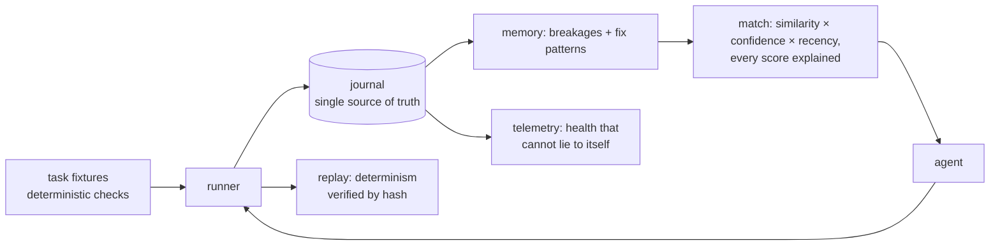

# mycelium

**An eval-harness-first agent memory loop.** It records what broke and what
fixed it, retrieves known fixes by signature — and *measures* whether that
memory actually helps, against deterministic checks, never self-reports.

> A self-improvement loop that cannot verify itself against external ground
> truth becomes decoration. This repo is built so it cannot lie to itself.

## The one number that matters

On the bundled corpus, repeating each task so the second encounter can use
memory from the first (`npm run demo`, seed 42, fully deterministic):

<!-- DEMO-TABLE-START (generated by npm run demo — regenerate, never hand-edit) -->

| metric | baseline | treatment | delta |
| --- | ---: | ---: | ---: |
| attempts | 8 | 8 | 0 |
| solved | 8 | 8 | 0 |
| failed | 0 | 0 | 0 |
| totalTurns | 20 | 14 | -6 |
| meanTurns | 2.50 | 1.75 | **-30%** |
| solveRate | 1.000 | 1.000 | +0.000 |
| wilson95 | [0.676, 1.000] | [0.676, 1.000] | — |

corpusHash identical (`991b8d497a32…`): fair A/B on the same corpus.
`determinism: verified` — the run replays bit-for-bit from its journal.
<!-- DEMO-TABLE-END -->

Baseline tries candidate fixes in fixed order and pays a turn per wrong guess;
the memory-first agent replays what worked for this breakage signature. Same
corpus, same checks, same clock — the only difference is memory. The report is
regenerated by the demo and the run is reproducible bit-for-bit; CI fails if
it isn't.

**Honesty note.** This is a *mechanism* benchmark with deterministic stand-in
solvers: it proves the memory loop works and is measured honestly. It does not
claim LLM-agent performance — the `Agent` interface is the extension point for
model-backed agents, and the harness is designed to A/B them the same way.

## Why this exists

The predecessor system ran self-healing loops inside a production app for six
months. A ruthless public audit found the composite failure: **heartbeats
impersonated real runs, stale data scored 100, and the dashboard read 88/B
while the engine was dormant.** The full audit trail is kept in
[`docs/audits/`](docs/audits/) — and every finding is now an invariant with a
property test:

| Lesson (from the audits) | Encoded as | Enforced by |
|---|---|---|
| Self-reported health is not data | [ADR-0001](docs/adr/0001-ground-truth-foundation.md) — ground truth = versioned fixtures + check exit codes | harness A/B on identical `corpusHash` |
| Activity is not execution | [ADR-0002](docs/adr/0002-activity-is-not-execution.md) — `heartbeat` can never be `system_executed` | property test: no burst of heartbeats lifts a score |
| Stale data must cost points | [ADR-0003](docs/adr/0003-staleness-decays-scores.md) — decay to floor, unknown scores worst | monotonicity property + regression test |

## Quickstart

```bash
npm install
npm run demo        # the A/B above, end to end
npm test            # unit + property-based tests (fast-check)
npm run typecheck   # strict TS: exactOptionalPropertyTypes, noUncheckedIndexedAccess
```

Programmatic:

```ts
import { ManualClock } from './src/core/clock.js';
import { createMemoryStore } from './src/memory/store.js';
import { memoryFirstSolver } from './src/harness/agent.js';
import { runHarness } from './src/harness/runner.js';

const clock = new ManualClock();
const memory = createMemoryStore(clock);
const run = runHarness(
  memoryFirstSolver(),
  { corpusDir: 'fixtures/tasks', seed: 42, repeatEach: 2 },
  { clock, memory },
);
// run.ok && run.value.summary.meanTurns === 1.75  (vs 2.50 without memory)
```

## How it works



Everything is derived from an append-only event journal. Health scoring reads
only `system_executed` events, decays with staleness, and enumerates its own
doubts in every report. Details in [docs/architecture.md](docs/architecture.md).

## Where this fails (read this first)

- **Memory can be wrong.** A signature collision can surface a fix that does
  not apply. Confidence is Laplace-smoothed and failures are recorded, but
  retrieval is heuristic — the harness exists precisely to measure this
  instead of asserting it.
- **Small bundled corpus.** Four fixtures prove the mechanism, nothing more.
  Real claims need a real corpus; the runner accepts any directory of tasks.
- **Stand-in solvers.** The built-in agents are deterministic. Wiring a
  model-backed `Agent` is documented but not shipped — cost and determinism
  are your problem then.
- **Signature normalization is lossy** by design (paths/numbers erased).
  Genuinely different bugs can collide; the trim and confidence math absorb
  some of this, not all.

## Status

v0.1 — core loop, harness, honesty scoring, replay verification, bundled demo
corpus. Roadmap: model-backed agent adapter, larger public corpus, memory
export/import across repos.

Origin: six months of self-healing experiments and their public audits in a
[production testbed](https://github.com/9tvf4k6srt-sys/NumbahWan-tcg).
License: MIT.
