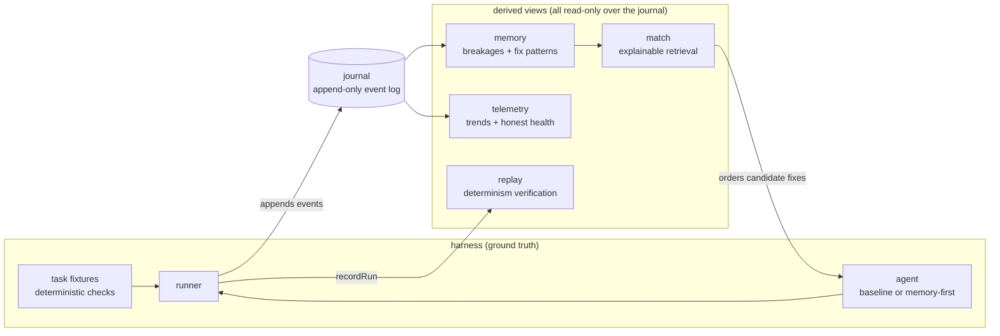

# Architecture

mycelium is a small library with one non-negotiable rule: **the journal is the
single source of truth, and every score is derived from it.** Modules never
trust each other's summaries; they read the same event log and derive
independent views.

## The run lifecycle

1. `loadCorpus` reads task fixtures from disk and computes a `corpusHash` —
   the exact identity of the ground truth for this run.
2. `runHarness` copies each fixture into an isolated temp directory, lets the
   agent attempt candidate fixes, and verifies **only by running the task's
   checks** (process exit codes). The agent's own opinion of its success is
   never consulted.
3. Every step is appended to the journal with a `ManualClock` timestamp and a
   content-seeded id. Time and identity are deterministic, so a run can be
   replayed bit-for-bit (`verifyDeterminism`).
4. On a solve, the breakage and fix outcome are recorded in memory. On a
   repeat encounter, `match` ranks candidate fixes by
   `similarity × confidence × recency` — and **explains each factor** in the
   `why` field.
5. `compareRuns` produces the only kind of claim this repo allows: an A/B
   difference on the same `corpusHash`, with Wilson confidence intervals.

## Module map

| Module | Responsibility | Key invariant |
|---|---|---|
| `core/result` | Error handling without exceptions | Expected failures are values |
| `core/clock` | Time as an injected dependency | Replay never reads the wall clock |
| `core/hash` | Canonical JSON + content addressing | Key order never changes a hash |
| `core/ids` | Branded, content-seeded ids | Same seed ⇒ same id |
| `core/events` | The event vocabulary | `heartbeat` is never `system_executed` (ADR-0002) |
| `core/journal` | Append-only log, JSONL round-trip | Round-trip preserves `eventHash` |
| `memory/signature` | Breakage normalization | Same bug, different path/line ⇒ same signature |
| `memory/store` | Breakage/fix evidence | `confidence = (successes+1)/(seen+2)` |
| `memory/trim` | Bounded memory | Evicts strictly lowest-weight first; keyed maps not exempt |
| `match/` | Fix retrieval | Every match explains its score |
| `telemetry/` | Trends + health | Stale data costs points; doubts are enumerated (ADR-0003) |
| `replay/` | Determinism as a tested property | Rerun must reproduce `eventHash` |
| `harness/` | External ground truth | Success = check exit code, nothing else |

## Design principles

Three ADRs encode the lessons of the predecessor system (see
`docs/audits/` for the evidence):

- [ADR-0001](adr/0001-ground-truth-foundation.md) — external ground truth is
  the foundation; self-reported health is not data.
- [ADR-0002](adr/0002-activity-is-not-execution.md) — activity is not
  execution; the alibi and the witness must be different events.
- [ADR-0003](adr/0003-staleness-decays-scores.md) — staleness decays scores;
  unknown scores worst, never best.

## Determinism model

A run is fully determined by `(corpus, agent, seed)`:

- `ManualClock` supplies all timestamps (fixed step per turn/check).
- `makeId` derives every id from content hashes — no randomness anywhere.
- `Journal.eventHash()` is the fingerprint of a run; `replay.verifyDeterminism`
  re-executes and compares fingerprints. If a dependency ever introduces
  hidden nondeterminism, the replay test fails — determinism is enforced by
  CI, not promised in prose.

## What this deliberately is not

- **Not an LLM agent.** The built-in solvers are deterministic mechanism
  stand-ins that make the memory loop measurable offline. The `Agent`
  interface is the extension point for real model-backed agents.
- **Not a framework.** No plugin system, no dependency injection container,
  no configuration language. Composition is function calls.
- **Not a dashboard.** `HealthReport` is data; rendering is someone else's
  problem.
